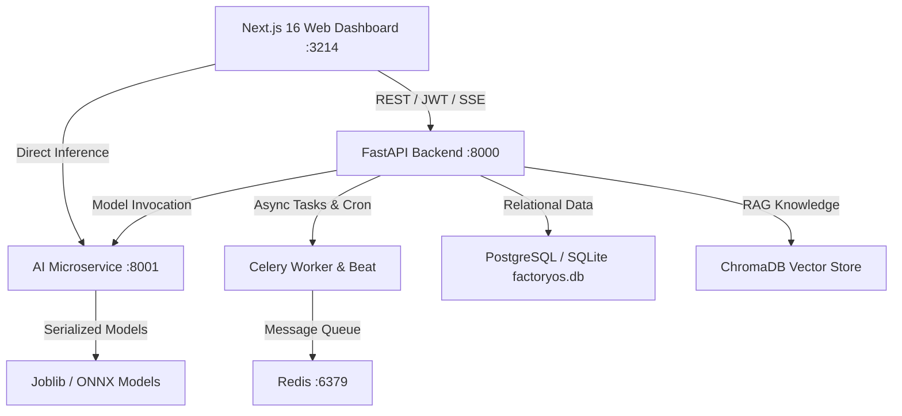

# Factory OS — Enterprise AI Decision Intelligence Platform

[](https://nextjs.org/)
[](https://react.dev/)
[](https://fastapi.tiangolo.com/)
[](https://tailwindcss.com/)
[](https://python.org/)
[-emerald)](backend/tests/)

**Factory OS** is a full-stack manufacturing intelligence and operations platform. It integrates real-time IoT telemetry streams, predictive machine learning prognostics (RUL & anomaly detection), RAG-grounded standard operating procedures (SOPs), and an autonomous multi-agent Decision Intelligence Copilot into a single enterprise dashboard.

---

## ⚡ Quick Start

### 1. Prerequisites
- **Python 3.11+**
- **Node.js 20+** / npm
- *(Optional)* **Docker & Docker Compose**

### 2. Installation & Bootstrap

```bash
# 1. Install Python dependencies
pip install -r backend/requirements.txt

# 2. Install Frontend & Root dependencies
cd frontend && npm install && cd ..
npm install

# 3. Generate ML Models & Seed SQLite Database
npm run init
```

### 3. Start All Services (1 Command)

```bash
npm run dev
```

This concurrently starts:
* **Frontend Dashboard**: [http://localhost:3214](http://localhost:3214)
* **FastAPI Backend REST API**: [http://localhost:8000](http://localhost:8000) (Interactive Swagger Docs: [`/docs`](http://localhost:8000/docs))
* **AI ML Inference Service**: [http://localhost:8001](http://localhost:8001) (API Docs: [`/docs`](http://localhost:8001/docs))

---

## 🔑 Demo Access Credentials

| Field | Value |
| :--- | :--- |
| **Email** | `alexander.vance@factoryos.ai` |
| **Password** | `password123` *(Pre-filled for instant 1-click Sign In)* |
| **Role** | Plant Manager / Enterprise Admin |

---

## 🌐 Application Architecture & Port Map



| Service | Port | Description |
| :--- | :--- | :--- |
| **Frontend Web App** | `3214` | Next.js 16 (Turbopack) + React 19 + Tailwind v4 + Zustand + Recharts |
| **Backend REST API** | `8000` | FastAPI v6 with async SQLAlchemy, JWT Auth, RBAC, SSE Streams & RAG Store |
| **AI ML Service** | `8001` | Dedicated ML inference engine (RUL regression, failure classification, anomaly detection) |
| **PostgreSQL** *(Docker)* | `5432` | Relational store for production orders, machines, alerts, and audit logs |
| **Redis** *(Docker)* | `6379` | Telemetry cache & Celery background task broker |

---

## 🧭 Project Directory Structure

```text
factory-os/
├── backend/                  # FastAPI Application Layer
│   ├── app/
│   │   ├── ai/              # Multi-Agent LangGraph supervisor, Gemini client, RAG store
│   │   ├── ai_engine/       # Master training pipeline, SHAP explainability
│   │   ├── analytics/       # OEE analytics calculation & optimization engine
│   │   ├── api/v1/          # REST route handlers (Auth, Machines, Orders, Copilot, etc.)
│   │   ├── core/            # Security, JWT tokens, RBAC permissions, audit logger
│   │   ├── db/              # SQLAlchemy async session management
│   │   ├── ml/              # Scikit-Learn inference predictor & model loader
│   │   ├── models/          # Database ORM models
│   │   ├── pipeline/        # Telemetry ingestion, data cleaners, Modbus/OPC-UA parsers
│   │   └── schemas/         # Pydantic validation schemas
│   └── tests/               # Backend pytest test suite (37 tests)
├── ai_service/              # Standalone High-Throughput ML Microservice
│   ├── app/                 # FastAPI routes, model registry, and prediction endpoints
│   └── tests/               # AI service pytest test suite (5 tests)
├── frontend/                # Next.js 16 Enterprise Frontend
│   ├── src/
│   │   ├── app/             # 17 App Router pages (Dashboard, Copilot, Production, etc.)
│   │   ├── components/      # UI components (DataTable, Modal, StatCard, Layouts)
│   │   ├── hooks/           # useApiData hook with automatic fallback
│   │   ├── mock/            # Offline fallback mock fixtures
│   │   ├── services/        # Typed HTTP API client with JWT session handling
│   │   └── store/           # Zustand global state (active factory, theme, alerts)
├── models/                  # Serialized Joblib models (generated by init_models.py)
├── scripts/                 # init_models.py, seed_database.py
└── docker-compose.yml       # Production multi-container orchestration
```

---

## 🌟 Core Features & Modules

### 1. 🤖 Decision Intelligence Copilot (`/copilot`)
* Multi-agent LangGraph supervisor fusing live IoT telemetry, ML failure predictions, and SOP knowledge.
* Preset high-impact diagnostic queries:
  * *Thermal anomaly detection on Laser Weld Cell 03*
  * *Line 4 OEE drop root-cause tracing*
  * *Carbon fiber raw material stockout forecasting*
  * *Shift A executive summary compilation*
* Resilient architecture with strict 2.5s timeout and automatic local expert consensus fallback.

### 2. 🏭 Production Operations & MES (`/production`)
* Live work order tracking with progress bars, defect metrics, and OEE ratings.
* Interactive **New Work Order** dispatch modal and **Shift Filter** selectors (Shift A/B/C).
* Line utilization rate bar charts and recent downtime incident logs.

### 3. 🔧 Predictive Asset Health (`/maintenance`)
* Fleet health scoring, vibration level (mm/s), and bearing temperature (°C) telemetry.
* AI-predicted **Remaining Useful Life (RUL)** degradation curves and SHAP feature attributions.
* Interactive **Work Order Dispatch** modal with technician team assignment.

### 4. 📦 Smart Inventory & Supply Chain (`/inventory`)
* Material inventory tracking with safety stock thresholds and supplier lead times.
* **Bulk Reorder Wizard** with 1-click automated emergency purchase requisition batches.
* In-app purchase order initiation with visual status feedback.

### 5. 🛡️ Quality Control & Computer Vision (`/quality`)
* Automated inspection logs with AI vision precision metrics (99.8%).
* Defect category Pareto distribution (Weld faults, Porosity, Dimensional deviation).
* AI Quality Root Cause hints for rapid parameter adjustment.

### 6. 📊 Analytics & Reporting (`/analytics` & `/reports`)
* Multi-shift OEE and yield comparison charts with thermal-vibration correlation analysis.
* 1-click **Dataset CSV Export** across customizable date ranges.
* Automated scheduled executive report compiler with direct file downloads (`.txt`, `.csv`).

### 7. 📚 Knowledge Base & SOP Library (`/knowledge-base`)
* Equipment operating manuals, maintenance protocols, and safety standards.
* Ingest new SOPs via the **Upload SOP Document** modal with tag indexing.
* Full-text and vector AI semantic search.

---

## 🧪 Testing & Verification

Run the complete automated test suite (100% pass rate across 42 tests):

```bash
# Run all tests (Backend + AI Service)
npm test

# Run Backend test suite only (37 tests)
npm run test:backend

# Run AI Service test suite only (5 tests)
npm run test:ai

# Run Frontend linting
npm run lint:frontend
```

---

## 🐳 Docker Deployment

To launch the full production stack including PostgreSQL 16, Redis 7, Celery Worker, Celery Beat, Backend, AI Service, and Frontend:

```bash
# Copy environment file
cp .env.example .env

# Build and start all containers
npm run docker:up

# Tear down containers and networks
npm run docker:down
```

---

## 📄 Key Endpoints Reference

| Endpoint | Method | Purpose |
| :--- | :--- | :--- |
| `/api/v1/auth/login` | `POST` | User login and JWT access/refresh token issuance |
| `/api/v1/auth/me` | `GET` | Current authenticated user profile and RBAC role |
| `/api/v1/machines/` | `GET` | Live telemetry and health metrics for all machines |
| `/api/v1/production/orders` | `GET` | Active and scheduled production work orders |
| `/api/v1/inventory/` | `GET` | Raw material inventory levels and threshold alerts |
| `/api/v1/recommendations/` | `GET` | AI-generated operational and prescriptive recommendations |
| `/api/v1/alerts/` | `GET` | Real-time threshold alarms and safety breaches |
| `/api/v1/copilot/query` | `POST` | Natural language multi-agent query processing |
| `/api/v1/analytics/oee` | `GET` | Plant-wide OEE calculation (Availability, Performance, Quality) |
| `/api/v1/predict/machine` | `POST` | Scikit-Learn / XGBoost failure risk & RUL predictions |

---

## 🛡️ License

Built for enterprise decision intelligence and industrial manufacturing operations.
