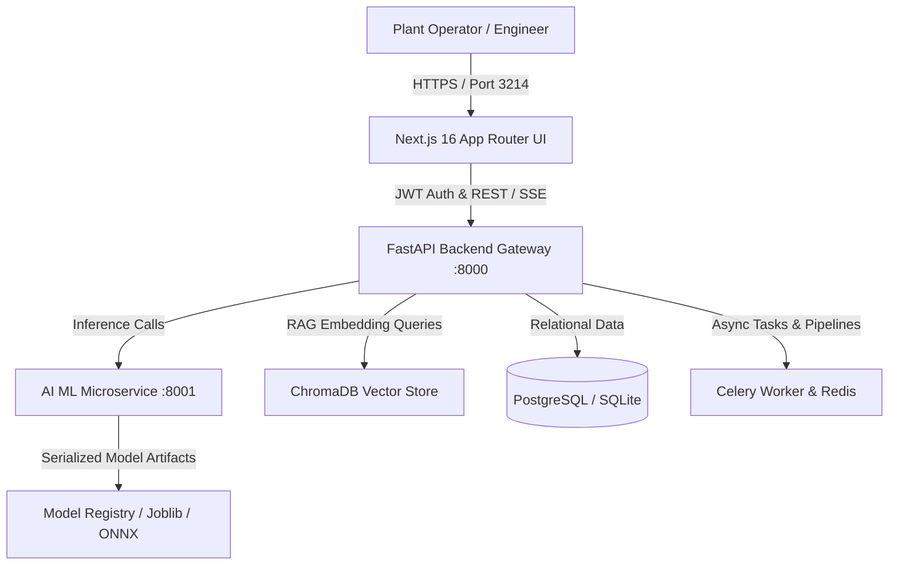

# Factory OS — Architecture Specification

## 1. System Overview
Factory OS is an industrial operational intelligence and adaptive ML platform designed for real-world discrete and continuous manufacturing plants. It bridges raw IIoT telemetry, edge sensor streams, relational MES databases, and predictive machine learning models into unified operator workflows.

## 2. Multi-Tier Architecture



## 3. Team Responsibilities & Ownership Matrix

| Agent / Owner | Responsibility Area | Key Interfaces |
| :--- | :--- | :--- |
| **Antigravity** | Frontend, UX, Operator workflows, Dashboards, User-facing states | `frontend/src/app/`, `components/`, `services/` |
| **Codex** | Dataset intelligence, Schema inference, Preprocessing, Feature engineering, ML/MLOps | `backend/app/ai_engine/`, `ai_service/app/` |
| **Cursor** | Backend platform, Database, Migrations, Auth, APIs, Queues, Storage, Integrations | `backend/app/api/`, `backend/app/core/`, `backend/app/db/` |
| **OpenCode** | Testing, QA, Security review, Reliability, Integration validation, Performance | `backend/tests/`, `ai_service/tests/`, `docs/testing/` |

## 4. End-to-End Operator Workflow Pipeline

```text
User
 ↓
Upload (Raw CSV/XLSX/JSON Dataset)
 ↓
Understand data (Schema Profiling, Cardinality, Value Distributions, Missingness)
 ↓
Review warnings (Anomalies, Zero-variance columns, Outlier spikes, Drift)
 ↓
Approve mapping (Source-to-Target mapping, Target variable assignment, Task type)
 ↓
Run processing (Cleaning pipeline, Imputation, Scaling, Feature Extraction, Model Train/Inference)
 ↓
View model (Model Card, Hyperparameters, Versioning, Precision/Recall, ROC-AUC, Confusion Matrix)
 ↓
Review prediction (Probabilities, Defect classification, Remaining Useful Life curve)
 ↓
Understand recommendation (Prescriptive engineering actions, Root-cause analysis, Estimated savings)
 ↓
Approve action (Dispatch MES work order, Adjust equipment parameters, Audit trail record)
 ↓
View report (Certified Manufacturing Intelligence Report, Export CSV/TXT)
```
