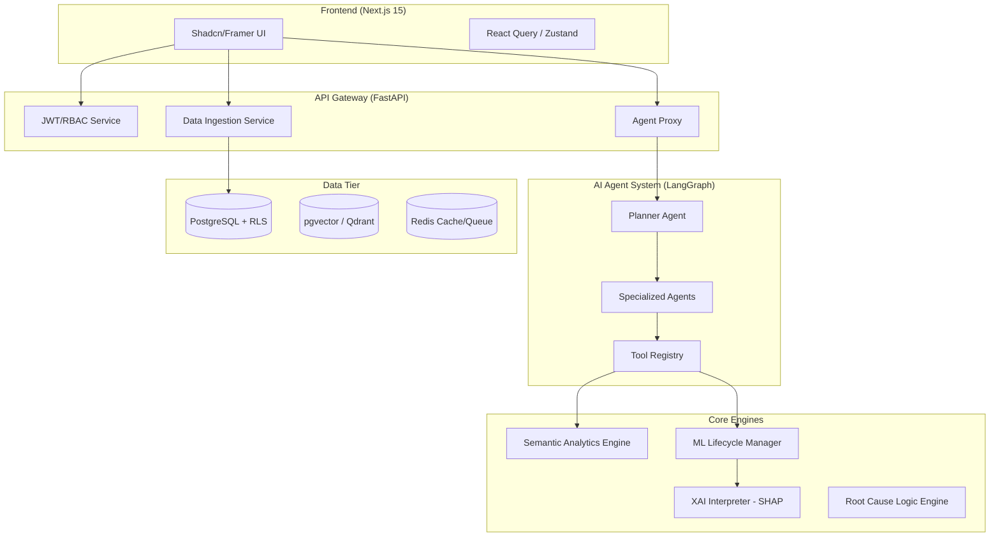

# Factory OS: Architectural Blueprint & Critical Review
**Version:** 1.0  
**Role:** Chief Software Architect  
**Status:** Phase 1 (Architecture Review)

---

## 1. Executive Summary
Factory OS is designed as a **Decision Intelligence Platform**. Unlike traditional monitoring tools, it prioritizes **Reasoning** over **Reporting**. This blueprint refines the initial requirements into a production-ready, scalable, and secure enterprise architecture.

---

## 2. Critical Review & Improvements

### 2.1 Schema Mapping & Data Resiliency
*   **Weakness:** Manufacturing data is notoriously inconsistent (e.g., "Timestamp" vs "date_time").
*   **Improvement:** Implement a **Schema Mapping Layer (SML)**. When a user uploads data, the system performs "Fuzzy Schema Detection" and allows the user to map their columns to our internal **Unified Manufacturing Schema (UMS)**.
*   **Rationale:** Ensures the Analytics Engine and ML models always receive deterministic inputs.

### 2.2 Semantic Metrics Store
*   **Weakness:** Having the AI call `calculate_oee()` is good, but without a shared context, different agents might calculate metrics differently.
*   **Improvement:** A centralized **Semantic Layer**. This layer defines the "Source of Truth" for KPIs (OEE, MTBF). Tools provided to LangGraph agents will query this layer, not the raw database.
*   **Rationale:** Guarantees consistency across the Dashboard, Reports, and AI Copilot.

### 2.3 Asynchronous Task Architecture
*   **Weakness:** ML training, XAI (SHAP) calculation, and large file processing are computationally expensive and will timeout a standard REST request.
*   **Improvement:** Integrate **Redis + Celery** for asynchronous task execution.
*   **Rationale:** Keeps the API responsive. Users get a `job_id` and can track progress via WebSockets or polling.

### 2.4 Multi-Tenancy & Security
*   **Weakness:** Enterprise users require strict data isolation.
*   **Improvement:** Use **PostgreSQL Row Level Security (RLS)**. Every table will have an `organization_id` and `factory_id`.
*   **Rationale:** Prevents cross-tenant data leaks at the database level, ensuring high security.

---

## 3. System Architecture (Component Diagram)



---

## 4. Agent Architecture (LangGraph Flow)

We will use a **Plan-and-Execute** pattern:
1.  **Planner Agent:** Breaks down user queries (e.g., "Why was OEE low yesterday?") into sub-tasks.
2.  **Specialized Agents:** (Production, Maintenance, Quality) execute specific tools.
3.  **Analytics Agent:** Aggregates tool outputs.
4.  **Reasoning Agent:** Applies the "Why" logic using RCA and XAI insights.
5.  **Executive Agent:** Formats the final response with business impact and recommendations.

---

## 5. Technology Stack Rationale

| Component | Technology | Rationale |
| :--- | :--- | :--- |
| **Backend** | FastAPI | High performance, async support, auto-generated OpenAPI. |
| **Database** | PostgreSQL | Enterprise standard, robust RLS, `pgvector` support for RAG. |
| **AI Orchestration**| LangGraph | State management for complex multi-agent reasoning loops. |
| **ML** | XGBoost / SHAP | Best-in-class for tabular data (typical in manufacturing). |
| **Frontend** | Next.js 15 | App router efficiency, Server Components for SEO/Speed. |
| **Real-time** | WebSockets | Live updates for data processing and AI streaming responses. |

---

## 6. Data Flow: From Upload to Decision
1.  **Ingestion:** User uploads Excel -> SML validates -> Stored in `raw_data`.
2.  **Processing:** Celery task triggers Cleaning -> Normalization -> Feature Engineering -> Stored in `processed_data`.
3.  **Analytics:** Background job updates `daily_metrics` (OEE, etc.).
4.  **ML Inference:** Predictions (e.g., Failure Risk) generated and stored with SHAP values.
5.  **Query:** User asks "Should I stop Machine 4?" -> Planner Agent calls `predict_failure()` and `check_maintenance_logs()` -> Returns recommendation.

---

## 7. Scalability & Security Plan
*   **Horizontal Scaling:** FastAPI and Celery workers can be scaled independently based on load.
*   **Security:** AES-256 encryption for data at rest. TLS 1.3 for data in transit. Standardized RBAC (Admin, Manager, Operator).

---

## 8. Development Folder Structure (Refined)

```text
factory-os/
├── backend/
│   ├── app/
│   │   ├── agents/         # LangGraph Agent Definitions
│   │   ├── api/            # API v1 Router & Endpoints
│   │   ├── core/           # Security, Config, Database Engine
│   │   ├── engines/        # Analytics, ML, RCA, XAI Logic
│   │   ├── models/         # SQLAlchemy RLS Models
│   │   ├── schemas/        # Pydantic Unified Schema (UMS)
│   │   ├── services/       # SML, Ingestion, Task Management
│   │   ├── tools/          # Agent Tool Implementation
│   │   └── worker.py       # Celery Worker Entry
│   ├── alembic/            # Migrations
│   └── tests/
├── frontend/
│   ├── src/
│   │   ├── app/            # App Router
│   │   ├── components/     # Dashboard, AI Chat, UI Kit
│   │   ├── hooks/          # Data Fetching (React Query)
│   │   ├── lib/            # API Clients, Utils
│   │   └── types/          # TypeScript Interfaces
├── shared/                 # Shared constants or types (optional)
└── docker-compose.yml
```

---

**Next Steps:**  
Awaiting Architect's approval for **Phase 1**. Once approved, I will proceed to **Phase 2: Database Schema Design (PostgreSQL + RLS)**.
